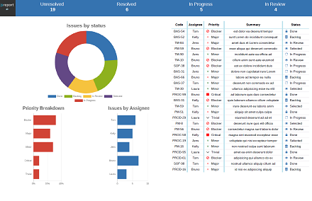
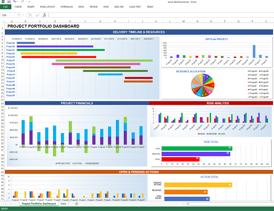

# nestjs-jsreport-examples

```console
git clone https://github.com/moofoo/nestjs-jsreport-examples && cd nestjs-jsreport-examples && yarn && yarn start:dev
```

This repo demonstrates what you can do with the core JSReport libraries programmatically in your own NodeJS apps. Neither JsReport's 'Template Studio', their SaaS offerings, or any other SaaS provider or external service is involved in creating these reports.

All templating and report generation is performed locally by the NestJS server, using the JSReport 'renderer core' and the necessary extensions.

The NestJS implementation is a work in progress. If you check back in a week or so, chances are it will be completely different.

I replicated all of the JSReport "[showcase](https://jsreport.net/showcases/)" reports, except for the "PDF Stock Report". Additional reports were pulled from examples in the [JSReport Playground](https://playground.jsreport.net/).

#

## Implemented Reports and Endpoints

<hr>

#

### [http://localhost:3333/reports/pdf-dashboard](http://localhost:3333/reports/pdf-dashboard)

- 

- Chrome PDF
- [Playground Link](https://playground.jsreport.net/w/admin/cBFKE3RY)

#

### [http://localhost:3333/reports/excel-dashboard](http://localhost:3333/reports/excel-dashboard)

- 

- Chrome PDF
- [Playground Link](https://playground.jsreport.net/w/admin/VvaGnaE)

#

### [http://localhost:3333/reports/student](http://localhost:3333/reports/student)

- 

- DocX
- [Playground Link](https://playground.jsreport.net/w/admin/d7o0nIWc)

#

### [http://localhost:3333/reports/ticket](http://localhost:3333/reports/ticket)

- 

- Chrome PDF
- [Playground Link](https://playground.jsreport.net/w/admin/ms2EkdfI)

#

### [http://localhost:3333/reports/pdf-forms](http://localhost:3333/reports/pdf-forms)

- 
- Chrome PDF
- [Playground Link](https://playground.jsreport.net/w/admin/lbhULCsP)

#

### [http://localhost:3333/reports/invoice](http://localhost:3333/reports/invoice)

- DocX
- [Playground Link](https://playground.jsreport.net/w/admin/yo9J3hvu)

#

### [http://localhost:3333/reports/invoice-xlsx](http://localhost:3333/reports/invoice-xlsx)

- Xlsx
- [Playground Link](https://playground.jsreport.net/w/admin/Lh8Kjc~f)

#

### [http://localhost:3333/reports/population](http://localhost:3333/reports/population)

- Xlsx
- [Playground Link](https://playground.jsreport.net/w/admin/V71OgRWt)

#

### [http://localhost:3333/reports/html-to-xlsx](http://localhost:3333/reports/html-to-xlsx)

- Html-to-Xlsx
- [Playground Link](https://playground.jsreport.net/w/admin/h45L49Dp)

#

Most of these will generate a PDF (instead .docx or .xlsx) with the query `pdf=1` (i.e, http://localhost:3333/reports/invoice?pdf=1)

#

#

## Commentary

The goal here is not to present a complete, self-contained and ready to use JSReports module, though that will probably happen eventually.

Rather, I wanted to

- Verify that the JSReport core libraries function adequately outside their usual web-based GUI context, as advertised.

- Demonstrate the feasiblity and potential of integrating JsReport with NestJS, in code (you're looking at it)

- Hopefully illustrate how useful and fully-featured the JSReport library is on its own, separate from the Studio GUI, to anyone paying attention, because I think it's cool.

#

#### **RANT**

JSReport, as far as I'm aware, is the only business reports company whose code base, top to bottem, is all open source and free for anyone to use. More impressively, they have intentionally architected their application as a collection of loosely coupled functional parts (extensions) that can be repurposd, mixed and matched, to perform useful work outside of their original Web GUI, Studio context. That is, outside the context where they make money for JSReport, as a business. And to top it all off, the core functionality on offer here - templating and doc gen - is **superlative**. Endless kudos.

Software like this really deserves more attention and love, especially given how bizarrely expensive and frankly predatory so many SaaS services in the space are.

#### **/RANT**
