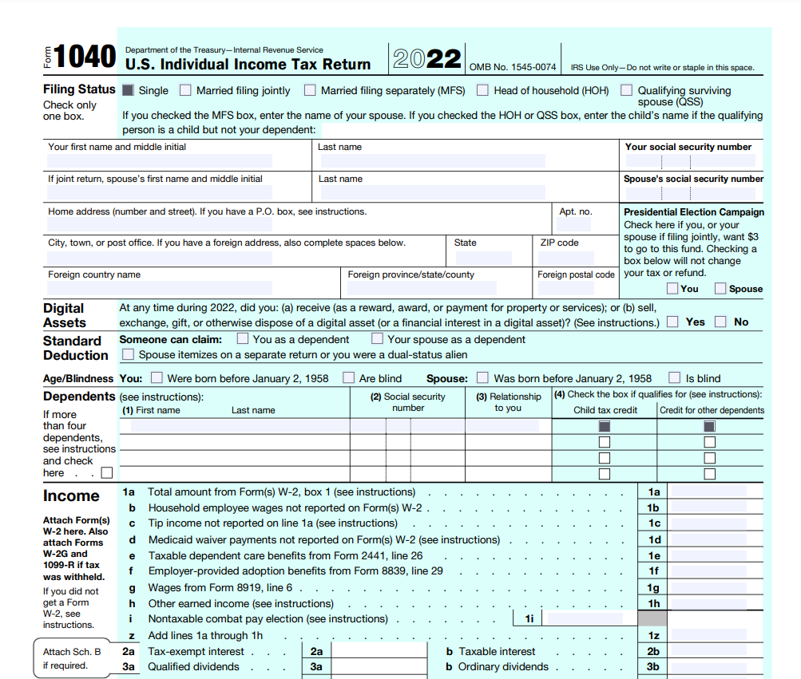

# nestjs-jsreport-examples

```console
git clone https://github.com/moofoo/nestjs-jsreport-examples && \
cd nestjs-jsreport-examples && \
yarn && \
yarn start:dev
```

This repo demonstrates what you can do with the core JSReport libraries programmatically in your own NodeJS apps.

Neither JsReport's 'Template Studio', their SaaS offerings, or any other SaaS provider or external service is involved in creating these reports. All templating and report generation is performed locally by the NestJS server, using the JSReport 'renderer core' and the necessary extensions.

The NestJS + JsReport integration is a work in progress. See [nest-js-report](https://github.com/moofoo/nest-js-report)

I replicated all of the JSReport "[showcase](https://jsreport.net/showcases/)" reports, except for the "PDF Stock Report". Additional reports were pulled from examples in the [JSReport Playground](https://playground.jsreport.net/).

#

## Implemented Reports and Endpoints

<hr>

#

### [http://localhost:3333/reports/pdf-dashboard](http://localhost:3333/reports/pdf-dashboard)

- 

- Chrome PDF
- [Playground Link](https://playground.jsreport.net/w/admin/cBFKE3RY)

#

### [http://localhost:3333/reports/excel-dashboard](http://localhost:3333/reports/excel-dashboard)

- 

- Chrome PDF
- [Playground Link](https://playground.jsreport.net/w/admin/VvaGnaE)

#

### [http://localhost:3333/reports/student](http://localhost:3333/reports/student)

- 

- DocX
- [Playground Link](https://playground.jsreport.net/w/admin/d7o0nIWc)

#

### [http://localhost:3333/reports/ticket](http://localhost:3333/reports/ticket)

- 

- Chrome PDF
- [Playground Link](https://playground.jsreport.net/w/admin/ms2EkdfI)

#

### [http://localhost:3333/reports/pdf-forms](http://localhost:3333/reports/pdf-forms)

- 
- Chrome PDF
- [Playground Link](https://playground.jsreport.net/w/admin/lbhULCsP)

#

### [http://localhost:3333/reports/invoice](http://localhost:3333/reports/invoice)

- DocX
- [Playground Link](https://playground.jsreport.net/w/admin/yo9J3hvu)

#

### [http://localhost:3333/reports/invoice-xlsx](http://localhost:3333/reports/invoice-xlsx)

- Xlsx
- [Playground Link](https://playground.jsreport.net/w/admin/Lh8Kjc~f)

#

### [http://localhost:3333/reports/population](http://localhost:3333/reports/population)

- Xlsx
- [Playground Link](https://playground.jsreport.net/w/admin/V71OgRWt)

#

### [http://localhost:3333/reports/htmlxlsx](http://localhost:3333/reports/htmlxlsx)

- Html-to-Xlsx
- [Playground Link](https://playground.jsreport.net/w/admin/h45L49Dp)
